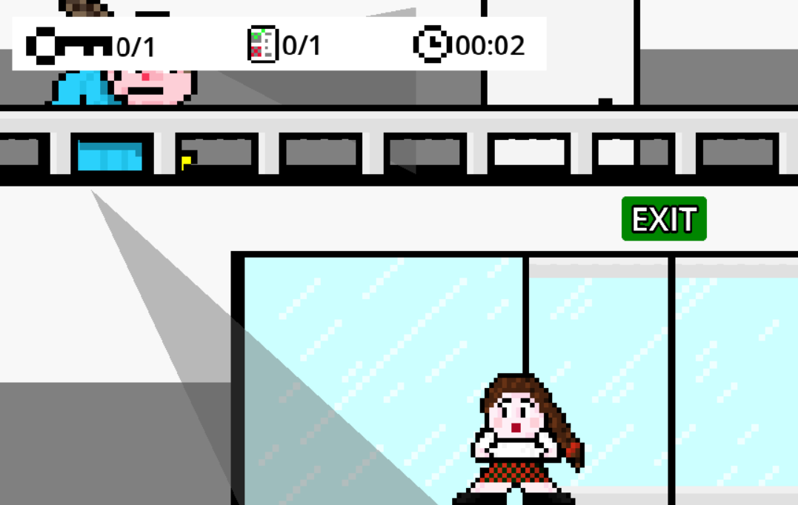

# Right under your moustache

This project was developed as part of the Digital Game Design and Development course. The objective of the game is to solve puzzles as quickly as possible without being detected in order to obtain the exam from Professor Augusto. To assist the player, we provide special powers.

Additionally, we were responsible for the game’s design, from the characters to all the background elements. We aimed to make the game as user-friendly as possible, incorporating sounds and music to enhance the experience.

See how to play [here](https://github.com/ema-12-martins/right_under_your_moustache/raw/main/DDJD-PP-G4-Right-Under-Your-Moustache-docs.pdf).

